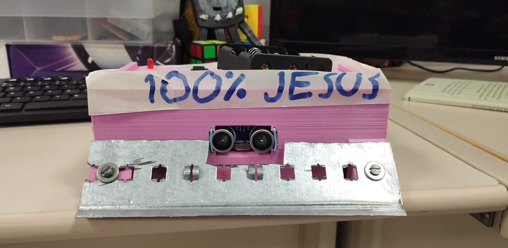

 
  
   <h1>Robô de Sumô - SugarBoom</h1>

## 📍 Sobre o projeto

Este projeto consiste no desenvolvimento de um robô autônomo lutador de sumô, capaz de detectar e empurrar objetos para fora de uma arena enquanto evita cair dela. O projeto é parte da disciplina de PI1 (Projeto Integrador de Engenharia 1) e envolve alunos de diversas engenharias, incluindo software, eletrônica, aeroespacial, energia e automotiva.

## 🧰 Tecnologias Utilizadas

- Arduino Uno (microcontrolador)
- Sensores ultrassônicos HC-SR04 (detecção de obstáculos)
- Sensores infravermelhos TCRT-5000 (detecção de borda)
- Motores com caixa de redução 12V, 500 RPM (movimentação)
- Pontes H BTS7960 43A (controle de motores)
- Baterias de íon-lítio ICR18650-22P M (alimentação)
- Linguagem C/C++ (programação embarcada)

*Consulte a [documentação completa](./docs/PI1_2024_2_Entrega_Final.pdf) do projeto para mais detalhes.* 

## 🏆 Equipe

| **Função**               | **Membros** |
|--------------------------|-------------|
| 🎯 **Gerência**           | [Ana Júlia (Gerente)](https://github.com/ailujana), [Raul Braga (Subgerente Geral)](https://github.com/Raul-10) |
| 🔋 **Desempenho Energético** | Pedro Tedesco |
| 🛠️ **Estruturas**         | Thiago Batista, [Yuri Machado (Subgerente)](https://github.com/YuriMup) |
| 💡 **Eletrônica**         | [Arthur da Silveira](https://github.com/Tutzs), [Vinícius Passeri](https://github.com/Hidratante), [Vitor Teixeira (Subgerente)](https://github.com/Vitorreix) |
| 💻 **Software**           | [Cauã Araujo](https://github.com/caua08), [Felipe Motta (Subgerente)](https://github.com/M0tt1nh4), [Gabriel Dantas](https://github.com/gbevi), [Júlio Cesar](https://github.com/Julio1099), Kauã Richard, [Maria Clara Oleari](https://github.com/Oleari19), [Weverton Rodrigues](https://github.com/vevetin), Weslley Alves |
